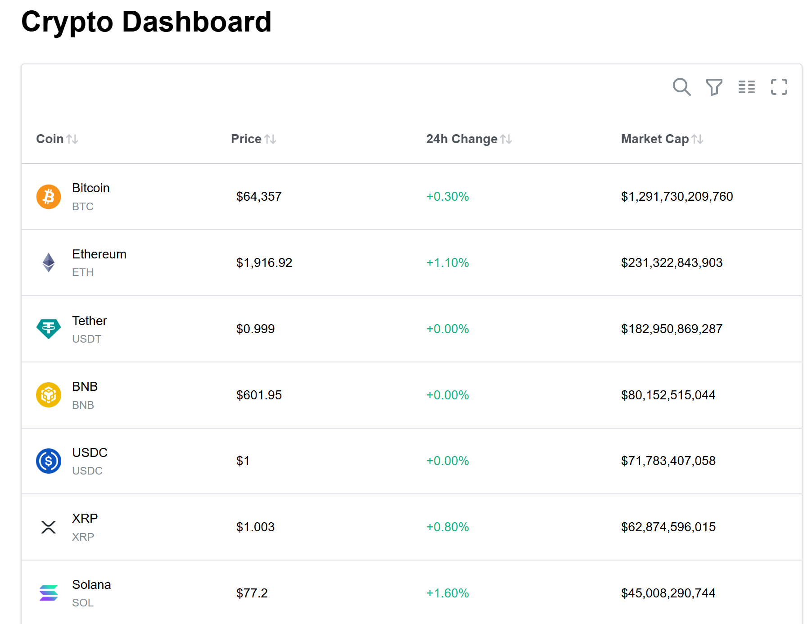

# Crypto Dashboard

A real-time cryptocurrency dashboard built with React and TypeScript, showcasing modern frontend engineering practices — from state management and API integration to testing, CI/CD, and cloud deployment.

**[Live Demo](https://d1qb67mzlj8228.cloudfront.net)** · **[Source Code](https://github.com/shirshovaanna53/crypto-dashboard-react)**



## Overview

Built as a hands-on project to work with technologies used in production frontend engineering: real-time data fetching, cloud deployment, and automated CI/CD pipelines — end to end, from local development to a live, publicly accessible application.

## Key Features

- **Live-updating price table** with polling-based real-time updates and a subtle flash animation highlighting actual price changes
- **Search, sort, and pagination** across a table of the top 20 cryptocurrencies by market cap
- **Price history chart** (7-day trend) displayed in a modal on row click, powered by Recharts
- **Loading, empty, and error states** handled gracefully throughout the UI

## Technical Highlights

### State Management & Data Fetching

- **Redux Toolkit + RTK Query** for API integration, caching, and automatic re-fetching
- **Polling** tuned to match the underlying data source's actual refresh rate, avoiding wasted requests
- **Request deduplication** via RTK Query's built-in caching — repeated interactions (e.g. reopening the same coin's chart) don't trigger redundant network calls
- **Skip queries** on demand (`skip: !coinId`) so the price-history endpoint is only called when a modal is actually open, not pre-emptively

### Code Quality & Maintainability

- **Single source of truth** for design tokens and copy — colors, durations, and error messages are centralized in `constants/`, rather than duplicated across components and tests
- **TypeScript throughout**, with shared type definitions decoupled from the API layer (`types/`)
- **ESLint + Prettier**, including `eslint-plugin-react-hooks` to catch incorrect hook usage early

### Testing

- **Vitest + React Testing Library** covering:
  - Custom hook logic in isolation (`usePriceFlash`)
  - Component rendering and visual states (loading, error, success)
  - Mocked RTK Query hooks to keep tests fast and independent of the live API

### Infrastructure & DevOps

- **Deployed on AWS** — S3 for static hosting, CloudFront as CDN with HTTPS
- **CI/CD via GitHub Actions** — every push to `main` automatically builds the app, syncs it to S3, and invalidates the CloudFront cache
- **Secrets management** — API keys and AWS credentials handled via GitHub Actions secrets, never committed to the repository

### Security & Accessibility

- Visible, non-default focus states on interactive elements (e.g. modal close button) for keyboard navigation
- Awareness of client-side API key exposure inherent to static frontend deployments, with a documented plan to proxy requests through AWS Lambda + API Gateway to keep credentials server-side

## Tech Stack

React · TypeScript · Redux Toolkit · RTK Query · Mantine · Recharts · Vitest · React Testing Library · Vite · GitHub Actions · AWS (S3, CloudFront)

## Data Source

Live market data from the [CoinGecko API](https://www.coingecko.com/en/api).

## Running Locally

```bash
npm install --legacy-peer-deps
npm run dev
```

Requires a `.env` file with a CoinGecko Demo API key:

```
VITE_COINGECKO_API_KEY=your_key_here
```

## Running Tests

```bash
npm run test
```
